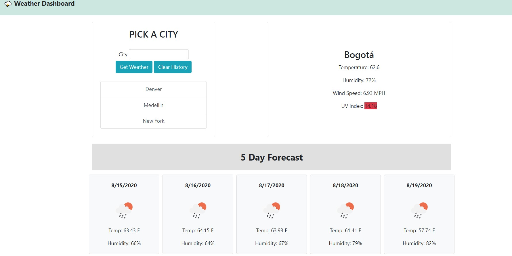

# Weather Dashboard

## Overview

This project for UCB Extension Full Stack Bootcamp is a interactive weather dashboard using server side API's to give you the current weather, your search history and a five day forcast for the city entered in the input.  The search input will return an alert if it does not receive data back meaning you entered a city that is not valid.

### Technologies used:

* HTML
* CSS
* JavaScript
* Jquery (very little)
* Bootstrap
* Open Weather Map API
* Local Storage

    

## API Calls

This appication makes 2 api calls.  
The first uses the city name and gives some information about current weather.  To get the extended and daily information for the city, I needed to do a second call using the Longitude and Latitude pulled from the first call.  I used 

## Current Weather

The current weather shows the temp, humidity, windspeed and UV Index.  The UV Index will dynamically change colors based on how severity of the ultraviolet rays.  I simply changed the bootstrap class tags to change background color for the span.
The current weather is displayed by simply creating an element, using innerHTML to fill in the contents, and appending the child.

## Forecast

I was able to display the 5 day forcast very similarly to the current weather.  The forecast displays and icon for the weather, the temp, date and humidity.  The only difference was I used a for loop to make an element for each day.  

## Search History

The search history uses local storage to display the cities that have already been searched for.  It logs the search into local storage after it returns a result to insure you dont save a bogus search that does not return data.  When the page loads it will append the previous searches using for loop that adds element, innerHTML and appendchild.  I made these a link to search for the previous result again.  I also made it so that duplicates do not show up and all of the cities are capitalized.
